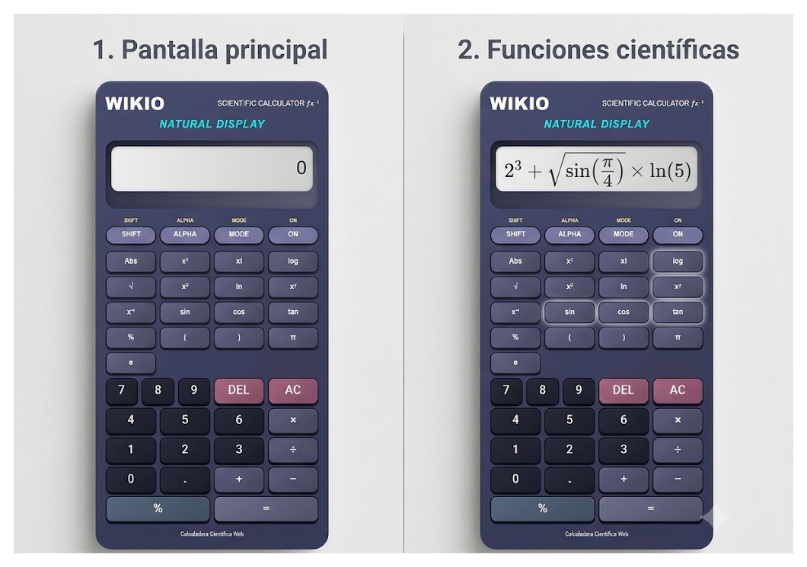

# 🧮 Calculadora Científica Web — WIKIO

## 📌 Nombre del proyecto

**WIKIO — Calculadora Científica Web**


## 🎯 Objetivo

Desarrollar una calculadora científica web interactiva utilizando tecnologías frontend, aplicando conocimientos de **HTML, CSS, Bootstrap y JavaScript**.

El proyecto tiene como finalidad implementar operaciones matemáticas básicas y funciones científicas mediante una interfaz moderna, organizada y adaptable a diferentes dispositivos.


## 💻 Tecnologías utilizadas

* **HTML5:** estructura y contenido de la aplicación.
* **CSS3:** diseño visual, colores, botones, pantalla y estilos responsive.
* **Bootstrap 5.3.3:** diseño responsive y organización de los componentes mediante el sistema de filas y columnas.
* **JavaScript:** implementación de la lógica matemática, interacción con los botones y funcionamiento de la calculadora.


## ⚙️ Funcionalidades implementadas

La calculadora permite realizar las siguientes operaciones:

### Operaciones básicas

* ➕ Suma
* ➖ Resta
* ✖️ Multiplicación
* ➗ División
* 🟰 Resultado mediante el botón `=`

### Funciones científicas

* √ Raíz cuadrada
* x² Potencia al cuadrado
* x³ Potencia al cubo
* xʸ Potencia con exponente personalizado
* x! Factorial
* x⁻¹ Inversa
* Abs Valor absoluto
* `sin` Seno
* `cos` Coseno
* `tan` Tangente
* `log` Logaritmo decimal
* `ln` Logaritmo natural
* `%` Porcentaje
* `π` Número Pi
* `e` Número de Euler

### Otras funciones

* `DEL` permite borrar el último carácter.
* `AC` permite limpiar completamente la pantalla.
* `ON` reinicia y muestra el estado de la calculadora.
* `SHIFT` permite activar o desactivar el modo Shift.
* `MODE` permite cambiar entre grados (**DEG**) y radianes (**RAD**).
* Soporte para teclado físico.
* Manejo de errores matemáticos.
* Pantalla de historial de la operación realizada.

---

## 🖥️ Diseño de la interfaz

La calculadora cuenta con una interfaz inspirada en una calculadora científica física.

Se implementaron:

* Diseño moderno.
* Botones diferenciados por función.
* Pantalla digital para mostrar las operaciones.
* Área de historial.
* Colores diferenciados para operadores y botones de control.
* Diseño adaptable para computadoras, tablets y teléfonos móviles.
* Uso de Bootstrap para organizar los elementos de la interfaz.


## 📱 Diseño responsive

El proyecto utiliza Bootstrap y reglas CSS mediante `@media` para adaptar la calculadora a diferentes tamaños de pantalla.

En dispositivos móviles se reducen los tamaños de los botones, la pantalla y los espacios internos para facilitar su utilización.

---

## 📂 Estructura del proyecto

El proyecto está organizado de la siguiente manera:

```text
calculadora-cientifica/
│
├── index.html
│
└── README.md
```

El archivo `index.html` contiene:

* Código HTML.
* Código CSS.
* Código JavaScript.
* Integración de Bootstrap.

De esta manera se cumple el requisito de desarrollar la calculadora utilizando un **único archivo HTML**.

---

## 🚀 Ejecución del proyecto

Para ejecutar la calculadora localmente:

1. Descargar o clonar el repositorio.
2. Abrir la carpeta del proyecto.
3. Abrir el archivo `index.html`.
4. Ejecutarlo utilizando un navegador web como **Google Chrome** o **Microsoft Edge**.

No es necesario instalar servidores ni programas adicionales porque se trata de una aplicación frontend.

---
## 📸 Capturas de pantalla

### Calculadora científica WIKIO




> **Nota:** Las imágenes deben ser agregadas posteriormente al repositorio y los nombres de los archivos deben coincidir con los utilizados en este README.


## 👥 Integrantes del grupo

| N.º | Integrante           |
| --- | -------------------- |
| 1   | **Quintero Natalia** |
| 2   | **Napa Angelica**    |
| 3   | **Daniela Requene**  |


## 🧠 Lógica de programación

La aplicación utiliza funciones JavaScript independientes para cada operación matemática.

Por ejemplo, las operaciones científicas utilizan métodos matemáticos incorporados en JavaScript como:

```javascript
Math.sqrt()
Math.pow()
Math.sin()
Math.cos()
Math.tan()
Math.log()
Math.log10()
Math.abs()
```

Para las funciones trigonométricas se implementó la conversión entre grados y radianes, permitiendo trabajar en los modos **DEG** y **RAD**.

También se implementaron validaciones para evitar resultados matemáticamente inválidos, como la división entre cero, logaritmos de valores no positivos y raíces cuadradas de números negativos.

---

## ⚠️ Dificultades encontradas

Durante el desarrollo del proyecto se presentaron algunas dificultades relacionadas con la implementación de las funciones científicas y la interacción entre los botones y la pantalla de la calculadora.

Entre las principales dificultades se encontraron:

* Implementar correctamente las operaciones científicas.
* Controlar los errores matemáticos.
* Implementar las funciones trigonométricas.
* Diferenciar el funcionamiento entre grados y radianes.
* Conseguir que los botones funcionaran correctamente.
* Adaptar la interfaz para dispositivos móviles.
* Implementar el funcionamiento mediante teclado físico.
* Organizar todo el código dentro de un único archivo HTML.

Estas dificultades permitieron reforzar los conocimientos sobre programación frontend, especialmente en el uso de JavaScript para controlar eventos y realizar operaciones matemáticas.


## 📚 Conclusiones

El desarrollo de la **Calculadora Científica Web WIKIO** permitió aplicar conocimientos de HTML, CSS, Bootstrap y JavaScript en un proyecto práctico.

La implementación de las operaciones básicas y científicas permitió fortalecer la lógica de programación y el manejo de funciones matemáticas mediante JavaScript.

Además, el uso de Bootstrap y CSS permitió desarrollar una interfaz responsive y organizada, capaz de adaptarse a diferentes dispositivos.

Finalmente, el proyecto permitió comprender la importancia de organizar correctamente el código, validar los datos ingresados por el usuario y diseñar una interfaz que facilite la interacción con la aplicación.


## 🌐 Repositorio

**GitHub:**
Agregar aquí el enlace al repositorio público de GitHub.
https://github.com/quinteronatalia247-alt/Calculadora-Cient-fica/edit/main/README.md


## 🎓 Proyecto académico

**Proyecto:** Desarrollo de Calculadora Científica Web
**Modalidad:** Trabajo grupal práctico
**Área:** Desarrollo Frontend
**Tecnologías:** HTML5, CSS3, Bootstrap 5 y JavaScript
